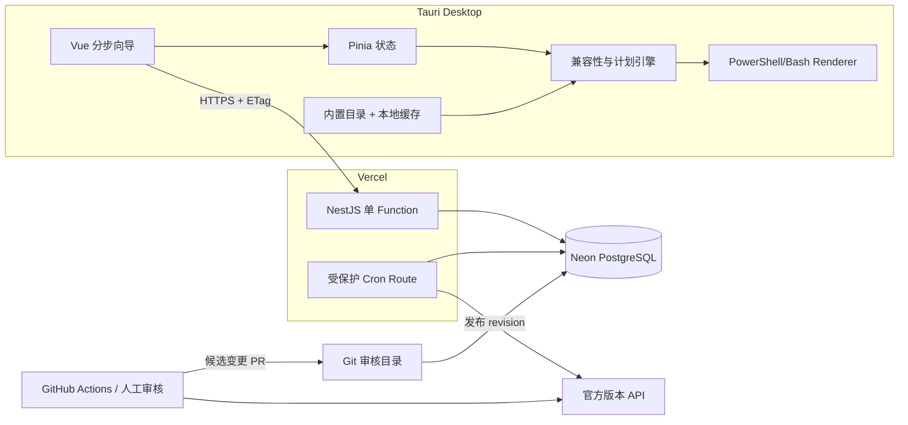
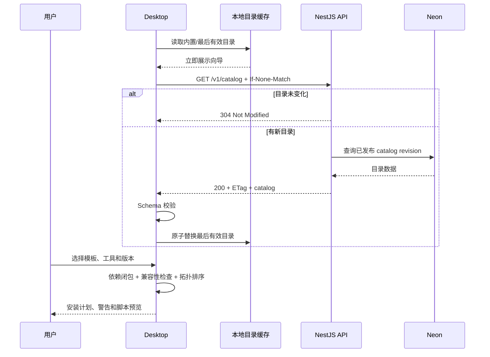

# 开发环境初始化助手技术设计

当前实现已在本设计的 MVP 基础上加入原生安装执行器，最新目录和验收边界见 [安装说明](installation.md)。下文保留最初的架构设计与阶段规划。

> 状态：可实施方案（MVP）  
> 最后核对：2026-09-06  
> 适用仓库：`siilvana-app`

## 1. 摘要

本产品面向刚拿到新电脑、刚重装系统或需要统一团队开发环境的开发者。用户不需要先理解每个包管理器和版本管理器，而是从“我要做前端、Java 后端或数据科学”开始，逐步得到一份解释清楚、兼容且可审阅的安装计划。

MVP 的核心闭环是：

1. 选择开发场景或模板。
2. 选择工具及版本，自动补齐依赖并解释冲突。
3. 针对 Windows、macOS、Ubuntu/Debian 生成安装计划。
4. 预览并导出 PowerShell 或 Bash 脚本。
5. 离线时继续使用内置目录，联网后安全更新元数据。

MVP **不直接执行安装、不静默提权、不开放匿名投稿**。这三个能力都会扩大安全面，不应与目录、兼容性和脚本生成同时进入首版。

### 1.1 核心产品判断

- 产品不是另一个包管理器。它编排 winget、Scoop、Chocolatey、Homebrew、apt 和 Volta 等现有工具。
- 产品不是 `mise` 或 `asdf` 的图形壳。差异在于场景向导、兼容性解释、跨包管理器计划和新手可读的故障建议。
- 安装命令不是普通内容，而是高风险供应链数据。只有审核过的结构化 recipe 能进入安装计划。
- Node.js 工具链默认采用 Volta 管理 Node/npm，项目依赖统一由 pnpm 管理。

## 2. 范围与验收边界

### 2.1 MVP 包含

- Windows 10/11、macOS、Ubuntu/Debian 的系统识别和脚本生成。
- 前端、Node.js 后端、Java 后端、Python/数据科学、全栈、自定义六类模板。
- 约 25-30 个经过人工验证的核心工具。
- 搜索、分类筛选、工具卡片、版本选择、推荐/EOL 标记、已选摘要。
- 必需依赖自动添加、推荐依赖提示、版本冲突和安装顺序计算。
- PowerShell/Bash 脚本预览、复制和保存。
- 内置目录、条件同步、最后有效缓存回退。
- 只读匿名 API 和受保护的目录同步入口。

### 2.2 MVP 不包含

- 任意命令执行、管理员自动提权或安装进度流。
- 用户账户、云端同步和多人协作。
- 匿名工具投稿及后台审核 UI。
- 完整机器状态收敛、卸载、回滚，或与 Nix 相同级别的可复现性。
- Windows 之外的所有 Linux 发行版；首版只保证 Debian 系 apt 路径。

## 3. 系统架构



### 3.1 关键数据流



### 3.2 共享逻辑边界

桌面端必须离线工作，因此不能把关键判断只放在服务端。`packages/shared` 提供无 Vue、NestJS、数据库依赖的纯函数；桌面端离线调用，服务端推荐接口复用同一规则，测试也只需维护一套行为。

服务端仍然是公开 HTTP 契约的源。NestJS DTO 通过 `@nestjs/swagger` 生成 OpenAPI，桌面端使用生成的 `packages/api-client`，避免手写请求类型与服务端漂移。

## 4. Monorepo 与工程工具链

### 4.1 目录

```text
siilvana-app/
├─ desktop/                     # Tauri 2 + Vue 3
│  ├─ src/
│  ├─ src-tauri/
│  └─ package.json
├─ server/                      # NestJS API
│  ├─ src/
│  ├─ drizzle/
│  ├─ vercel.json
│  └─ package.json
├─ packages/
│  ├─ shared/                   # 规则、类型、计划 IR、renderer
│  ├─ api-client/               # OpenAPI 生成，不手工编辑
│  └─ catalog/                  # 内置目录、schema、seed
├─ scripts/                     # 同步适配器和目录校验
├─ docs/
├─ package.json
├─ pnpm-workspace.yaml
└─ pnpm-lock.yaml
```

`pnpm-workspace.yaml`：

```yaml
packages:
  - desktop
  - server
  - packages/*
```

根 `package.json` 基线：

```json
{
  "name": "siilvana-app",
  "private": true,
  "packageManager": "pnpm@10.34.5",
  "engines": {
    "node": "24.x",
    "pnpm": "10.x"
  },
  "volta": {
    "node": "24.20.0",
    "npm": "11.19.0"
  },
  "scripts": {
    "dev": "pnpm --parallel --filter @siilvana/desktop --filter @siilvana/server dev",
    "build": "pnpm -r build",
    "test": "pnpm -r test",
    "typecheck": "pnpm -r typecheck",
    "catalog:validate": "pnpm --filter @siilvana/catalog validate",
    "api:generate": "pnpm --filter @siilvana/server openapi && pnpm --filter @siilvana/api-client generate"
  }
}
```

### 4.2 Volta 与 pnpm 的职责

Volta 固定 Node 和 npm。pnpm 是仓库唯一依赖管理器：

```bash
volta install node@24.20.0 npm@11.19.0
npm install --global pnpm@10.34.5
pnpm install --frozen-lockfile
```

这里使用 npm 只负责安装 pnpm 本身，不使用 npm 安装项目依赖。Volta 会让 `node`、`npm` 及通过其 npm 全局安装的命令运行在固定 Node 工具链中。

不启用 `VOLTA_FEATURE_PNPM=1`，因为 [Volta 官方仍将原生 pnpm 支持标记为实验特性](https://docs.volta.sh/advanced/pnpm)。同时通过 `packageManager` 字段和 CI 版本固定防止 pnpm 漂移。Node 25 起不再随发行版提供 Corepack，因此方案也不依赖系统自带 Corepack（[Node.js Corepack 文档](https://nodejs.org/download/release/v25.8.0/docs/api/corepack.html)）。

### 4.3 锁文件和 CI 约束

- 只提交根 `pnpm-lock.yaml`。
- CI 检查不存在 `package-lock.json`、`npm-shrinkwrap.json`、`yarn.lock`、子目录 `pnpm-lock.yaml`。
- 所有安装使用 `pnpm install --frozen-lockfile`。
- Vercel 依靠根锁文件和 `packageManager` 识别 pnpm；项目 Root Directory 设置为 `server/`，并开启访问 Root Directory 外 workspace 源码。Vercel 官方支持 pnpm workspace，并要求内部依赖在各自 `package.json` 明确声明（[Vercel Monorepos](https://vercel.com/docs/monorepos)）。

## 5. 桌面端设计

### 5.1 信息架构

```text
AppShell
├─ AppHeader
│  ├─ StepIndicator
│  └─ ConnectivityStatus
├─ WizardPage
│  ├─ ScenarioStep
│  ├─ ToolSelectionStep
│  │  ├─ ToolSearch
│  │  ├─ CategoryTabs
│  │  ├─ ToolGrid
│  │  │  └─ ToolCard
│  │  │     ├─ ToolSvgIcon
│  │  │     ├─ VersionSelect
│  │  │     └─ DependencyHint
│  │  └─ SelectionSummary
│  ├─ ReviewStep
│  │  ├─ InstallOrder
│  │  ├─ CompatibilityDiagnostics
│  │  └─ DiskEstimate
│  └─ ExportStep
│     ├─ PackageManagerChoice
│     ├─ ScriptPreview
│     └─ ExportActions
└─ ToolDetailDialog
```

桌面宽度充足时，`SelectionSummary` 固定在右侧；窄窗口下改为底部抽屉。工具网格使用稳定轨道 `repeat(auto-fill, minmax(260px, 1fr))`，卡片高度固定，版本选择和警告不会推动网格跳动。

### 5.2 Pinia 状态

```ts
export const useWizardStore = defineStore('wizard', () => {
  const step = ref<1 | 2 | 3 | 4>(1);
  const platform = ref<TargetPlatform>();
  const scenario = ref<ScenarioId>();
  const selections = ref(new Map<ToolId, VersionId>());
  const explicitSelections = ref(new Set<ToolId>());

  const resolution = computed(() =>
    resolveSelection(catalog.value, {
      platform: platform.value,
      requested: selections.value,
      explicit: explicitSelections.value,
    }),
  );

  function selectTool(toolId: ToolId, versionId: VersionId) {
    selections.value.set(toolId, versionId);
    explicitSelections.value.add(toolId);
  }

  return { step, platform, scenario, selections, resolution, selectTool };
});
```

必须区分“用户主动选择”和“自动添加依赖”。取消必需依赖时，UI 不应悄悄删除依赖它的工具，而应提供两个明确动作：恢复依赖，或连同依赖方一起取消。

### 5.3 Volta/Node/npm/pnpm 的展示

- `Volta` 是版本管理器卡片。
- `Node.js` 是由 Volta 或系统包管理器提供的运行时卡片。
- `npm` 是 Node 附带、可由 Volta 固定版本的工具，不作为默认依赖安装器。
- `pnpm` 是项目依赖管理器，默认随前端、Node 后端和全栈模板选中。
- 启用 Volta 时，将系统 Node recipe 标为被替代，不生成重复步骤。
- 检测到已有系统 Node 时显示 PATH 接管提示，但不把它当作冲突；用户可保留系统安装。

推荐计划在摘要中显示：

```text
Node.js 24 LTS        由 Volta 管理
npm 11.19.0           由 Volta 固定
pnpm 10.34.5          使用 npm 安装，负责项目依赖
```

## 6. 服务端与 Vercel

### 6.1 部署方式

Vercel 已原生识别标准 NestJS 项目。应用保持 `@nestjs/platform-express` 和常规 `app.listen()` 即可；整个 NestJS 应用会部署为一个 Vercel Function，并由路由器分发到控制器。Fluid compute 会复用已初始化实例，降低重复创建 Nest 依赖注入容器的成本（[Vercel NestJS 指南](https://vercel.com/kb/guide/ship-a-nestjs-app-on-vercel)）。

不采用：

- 不存在必要性的 `@nestjs/platform-serverless`。
- 额外的 `serverless-http` Express 包装。
- Edge runtime；NestJS、Drizzle 迁移和部分 Node 依赖需要完整 Node runtime。
- `@nestjs/schedule` 常驻任务；Serverless 实例不会持续运行。

### 6.2 最小入口

```ts
// server/src/app/main.ts
import 'reflect-metadata';
import { ValidationPipe } from '@nestjs/common';
import { NestFactory } from '@nestjs/core';
import { SwaggerModule, DocumentBuilder } from '@nestjs/swagger';
import { AppModule } from './app.module';

async function bootstrap() {
  const app = await NestFactory.create(AppModule);
  const desktopOrigins = (
    process.env.DESKTOP_ORIGIN ??
    'tauri://localhost,http://tauri.localhost,http://localhost:1420'
  ).split(',');
  app.enableCors({ origin: desktopOrigins });
  app.useGlobalPipes(new ValidationPipe({ whitelist: true, transform: true }));
  app.setGlobalPrefix('v1', {
    exclude: ['health', 'internal/cron/catalog-sync'],
  });

  const config = new DocumentBuilder()
    .setTitle('Siilvana Catalog API')
    .setVersion('1.0')
    .build();
  const document = SwaggerModule.createDocument(app, config);
  SwaggerModule.setup('docs', app, document);

  await app.listen(Number(process.env.PORT ?? 3000));
}

void bootstrap();
```

### 6.3 `vercel.json`

```json
{
  "$schema": "https://openapi.vercel.sh/vercel.json",
  "framework": "nestjs",
  "regions": ["hkg1"],
  "crons": [
    {
      "path": "/internal/cron/catalog-sync",
      "schedule": "0 3 * * *"
    }
  ]
}
```

区域必须选择靠近 Neon 主区域的位置，而不是机械使用示例中的 `hkg1`。标准 Nest 入口无需 rewrite、build command 或 output directory。Vercel Cron 使用 UTC，Hobby 计划最多每天一次且触发时间可能位于指定小时内；Cron 也不会自动重试（[Vercel Cron 管理](https://vercel.com/docs/cron-jobs/manage-cron-jobs)）。

### 6.4 冷启动与数据库连接

- 保持单一 `AppModule`，不要在每次请求内 `NestFactory.create()`。
- 避免把爬虫、浏览器、完整图标集等重依赖打入服务端函数。
- Neon HTTP 适合目录读取这类单次、非交互事务；需要多语句事务的管理任务使用 Neon WebSocket driver 或数据库函数。
- 不在模块初始化时做远程版本同步。
- 监控函数启动时长、P95、数据库请求时长和包体积。Vercel Node Function 解压后上限为 250 MB（[Vercel Function Limits](https://vercel.com/docs/functions/limitations)）。

```ts
// server/src/database/database.provider.ts
import { neon } from '@neondatabase/serverless';
import { drizzle } from 'drizzle-orm/neon-http';
import * as schema from './schema';

export const DB = Symbol('DB');

export const databaseProvider = {
  provide: DB,
  useFactory: () => {
    if (!process.env.DATABASE_URL) throw new Error('DATABASE_URL is required');
    const client = neon(process.env.DATABASE_URL);
    return drizzle({ client, schema });
  },
};
```

Drizzle 对 Neon HTTP 和 WebSocket driver 均有原生支持；HTTP 更适合 one-shot 查询（[Drizzle Neon 连接文档](https://orm.drizzle.team/docs/connect-neon)、[Neon Serverless Driver](https://neon.com/docs/serverless/serverless-driver)）。

### 6.5 Cron 鉴权和幂等

```ts
@Controller('internal/cron')
export class CatalogCronController {
  constructor(private readonly syncService: CatalogSyncService) {}

  @Get('catalog-sync')
  async sync(@Headers('authorization') authorization?: string) {
    const expected = process.env.CRON_SECRET;
    if (!expected || authorization !== `Bearer ${expected}`) {
      throw new UnauthorizedException();
    }

    return this.syncService.reconcileOfficialSources({
      runKey: new Date().toISOString().slice(0, 10),
    });
  }
}
```

`sync_runs.run_key` 建唯一索引；重复调用返回已有结果。同步按“从最后成功时间重新拉取并 upsert”设计，以承受漏调和重复调度。不得依赖内存锁；需要互斥时用 PostgreSQL advisory lock。

## 7. 数据模型

### 7.1 表结构

| 表 | 关键字段 | 说明 |
|---|---|---|
| `categories` | `id`, `slug`, `name`, `sort_order` | 工具分类 |
| `tools` | `id`, `slug`, `name`, `description`, `category_id`, `homepage_url`, `icon_key`, `version_scheme`, `status` | 工具主体 |
| `tool_versions` | `id`, `tool_id`, `version`, `channel`, `release_date`, `eol_date`, `recommended`, `managed_by_tool_id`, `bundled_tools`, `source_ref` | 可选版本及管理关系 |
| `install_recipes` | `id`, `tool_version_id`, `platform`, `arch`, `strategy`, `manager`, `package_id`, `arguments`, `verify_executable`, `verify_arguments`, `priority`, `review_status` | 结构化安装方法 |
| `dependency_rules` | `id`, `source_tool_id`, `target_tool_id`, `target_range`, `kind`, `platforms`, `cancelable` | 必需/推荐依赖 |
| `compatibility_rules` | `id`, `left_tool_id`, `left_range`, `right_tool_id`, `right_range`, `relation`, `severity`, `message`, `platforms` | 兼容、冲突与建议 |
| `templates` | `id`, `slug`, `name`, `scenario`, `description`, `status` | 场景模板 |
| `template_items` | `template_id`, `tool_id`, `version_selector`, `required`, `sort_order` | 模板工具 |
| `catalog_releases` | `id`, `revision`, `schema_version`, `content_hash`, `published_at`, `status` | 可同步目录版本 |
| `sync_runs` | `id`, `run_key`, `source`, `status`, `started_at`, `finished_at`, `stats`, `error_summary` | 外部源同步记录 |
| `contributions` | `id`, `device_token_hash`, `payload`, `status`, `created_at`, `reviewed_at` | 第二阶段匿名投稿 |

所有主键使用 UUID。`slug`、`revision`、`sync_runs.run_key` 唯一；外键列和常用过滤列建索引。`arguments`、`bundled_tools`、`platforms` 使用 JSONB，但工具、版本和依赖关系保持关系型结构，避免把整个目录塞进一列 JSON。

### 7.2 Drizzle 示例

```ts
export const tools = pgTable('tools', {
  id: uuid('id').defaultRandom().primaryKey(),
  slug: varchar('slug', { length: 80 }).notNull().unique(),
  name: varchar('name', { length: 120 }).notNull(),
  description: text('description').notNull(),
  categoryId: uuid('category_id').notNull().references(() => categories.id),
  homepageUrl: text('homepage_url').notNull(),
  iconKey: varchar('icon_key', { length: 100 }).notNull(),
  versionScheme: varchar('version_scheme', { length: 16 }).$type<
    'semver' | 'numeric' | 'calver' | 'opaque'
  >().notNull(),
  status: varchar('status', { length: 16 }).$type<'active' | 'hidden'>().notNull(),
});

export const toolVersions = pgTable('tool_versions', {
  id: uuid('id').defaultRandom().primaryKey(),
  toolId: uuid('tool_id').notNull().references(() => tools.id),
  version: varchar('version', { length: 64 }).notNull(),
  channel: varchar('channel', { length: 16 }).$type<
    'lts' | 'stable' | 'current' | 'eol'
  >().notNull(),
  releaseDate: date('release_date'),
  eolDate: date('eol_date'),
  recommended: boolean('recommended').default(false).notNull(),
  managedByToolId: uuid('managed_by_tool_id').references(() => tools.id),
  bundledTools: jsonb('bundled_tools').$type<Array<{
    toolSlug: string;
    version: string;
  }>>().default([]).notNull(),
  sourceRef: text('source_ref').notNull(),
}, (table) => [unique().on(table.toolId, table.version)]);

export const installRecipes = pgTable('install_recipes', {
  id: uuid('id').defaultRandom().primaryKey(),
  toolVersionId: uuid('tool_version_id').notNull().references(() => toolVersions.id),
  platform: varchar('platform', { length: 16 }).$type<'windows' | 'macos' | 'linux'>().notNull(),
  arch: varchar('arch', { length: 16 }).$type<'x64' | 'arm64' | 'any'>().notNull(),
  strategy: varchar('strategy', { length: 24 }).$type<
    'system-package' | 'version-manager' | 'package-binary'
  >().notNull(),
  manager: varchar('manager', { length: 24 }).notNull(),
  packageId: varchar('package_id', { length: 160 }).notNull(),
  arguments: jsonb('arguments').$type<string[]>().default([]).notNull(),
  verifyExecutable: varchar('verify_executable', { length: 120 }).notNull(),
  verifyArguments: jsonb('verify_arguments').$type<string[]>().default([]).notNull(),
  priority: integer('priority').default(100).notNull(),
  reviewStatus: varchar('review_status', { length: 16 })
    .$type<'draft' | 'approved' | 'rejected'>().notNull(),
});
```

### 7.3 Volta 管理关系示例

```json
{
  "tool": "node",
  "version": "24.20.0",
  "channel": "lts",
  "managedByToolId": "volta",
  "bundledTools": [{ "toolSlug": "npm", "version": "11.19.0" }]
}
```

pnpm 不是 Node 的 bundled tool。它是 `package-binary` recipe，依赖 Node/npm，默认使用 `npm install --global pnpm@10.34.5` 安装到 Volta 工具链。

## 8. 公共 TypeScript 契约

```ts
export type TargetPlatform = 'windows' | 'macos' | 'linux';
export type Architecture = 'x64' | 'arm64';
export type PackageManager = 'winget' | 'scoop' | 'choco' | 'brew' | 'apt' | 'volta' | 'npm';

export interface InstallPlanRequest {
  platform: TargetPlatform;
  architecture: Architecture;
  distro?: 'ubuntu' | 'debian';
  preferredManagers: PackageManager[];
  selections: Array<{ toolId: string; versionId: string }>;
}

export interface ProcessSpec {
  executable: string;
  args: string[];
}

export interface InstallStep {
  id: string;
  toolId: string;
  versionId: string;
  manager: PackageManager;
  reason: 'explicit' | 'required' | 'bundled';
  process: ProcessSpec;
  verify: ProcessSpec;
  requiresElevation: boolean;
}

export interface Diagnostic {
  code: string;
  severity: 'info' | 'warning' | 'error';
  toolIds: string[];
  message: string;
  suggestedVersionId?: string;
}

export interface InstallPlanResponse {
  catalogRevision: string;
  steps: InstallStep[];
  diagnostics: Diagnostic[];
  script: { shell: 'powershell' | 'bash'; content: string };
}
```

公开 API 不接收 `executable`、`args` 或脚本文本。客户端只能提交工具/版本 ID 和有限枚举，服务端从已发布目录解析 `ProcessSpec`。

## 9. 依赖与兼容性引擎

### 9.1 规则表达

```json
[
  {
    "kind": "requires",
    "source": { "tool": "pnpm", "range": ">=10 <11" },
    "target": { "tool": "node", "range": ">=18" },
    "severity": "error",
    "message": "pnpm 10 需要 Node.js 18 或更高版本。"
  },
  {
    "kind": "recommends",
    "source": { "tool": "spring-boot", "range": ">=3 <4" },
    "target": { "tool": "jdk", "range": ">=17 <26" },
    "severity": "warning",
    "message": "Spring Boot 3 建议使用仍在支持期内的 JDK 17、21 或 25。"
  },
  {
    "kind": "replaces",
    "source": { "tool": "volta", "range": "*" },
    "target": { "recipe": "node-system-package" },
    "severity": "info",
    "message": "Node.js 将由 Volta 管理，不再生成系统 Node 安装步骤。"
  }
]
```

### 9.2 解析流程

1. 标准化用户显式选择。
2. 展开模板默认项。
3. 递归添加 `requires` 依赖并记录来源。
4. 展开 bundled tools，例如 Node -> npm。
5. 应用 managed-by/replaces 规则去除重复 recipe。
6. 运行 `requires`、`conflicts`、`recommends` 版本匹配。
7. 建立依赖有向图并拓扑排序。
8. 出现环时返回 `DEPENDENCY_CYCLE`，不生成可执行脚本。
9. 存在 error 诊断时允许浏览计划，但禁用导出。

```ts
export function resolveSelection(catalog: Catalog, input: ResolveInput): Resolution {
  const selected = normalizeRequested(input.requested);
  expandRequiredDependencies(catalog, selected);
  expandBundledTools(catalog, selected);
  applyManagedByReplacements(catalog, selected);

  const diagnostics = evaluateRules(catalog.compatibilityRules, selected, input.platform);
  const graph = buildDependencyGraph(catalog, selected);
  const order = topologicalSort(graph);

  if (order.cycle) {
    diagnostics.push({
      code: 'DEPENDENCY_CYCLE',
      severity: 'error',
      toolIds: order.cycle,
      message: `检测到循环依赖：${order.cycle.join(' -> ')}`,
    });
  }

  return { selected, orderedToolIds: order.nodes, diagnostics };
}
```

版本方案按工具声明处理：SemVer 使用 `semver`；Java 等纯数字主版本先标准化为 `17.0.0`；CalVer 单独比较；opaque 版本只允许精确匹配。不能把所有厂商版本强行交给 SemVer。

## 10. 安装脚本生成

### 10.1 结构化 IR

数据库保存 `manager + packageId + args`，共享层产生有序 `ProcessSpec`，最后由 shell renderer 转成脚本。这样可以：

- 在进入 renderer 前完成包名和参数白名单校验。
- 为同一计划输出 PowerShell 和 Bash。
- 后续直接执行时复用参数数组，不重新解析 shell 文本。
- 对 renderer 做稳定的 golden snapshot 测试。

Handlebars 只允许渲染固定页眉、错误处理和注释，不允许社区内容成为表达式或未转义参数。

### 10.2 转义

```ts
const SAFE_EXECUTABLE = /^[A-Za-z0-9._+-]+$/;

export function quoteBash(value: string): string {
  if (value.includes('\0') || value.includes('\n') || value.includes('\r')) {
    throw new Error('Unsafe shell argument');
  }
  return `'${value.replaceAll("'", `'"'"'`)}'`;
}

export function quotePowerShell(value: string): string {
  if (value.includes('\0') || value.includes('\r')) {
    throw new Error('Unsafe PowerShell argument');
  }
  return `'${value.replaceAll("'", "''")}'`;
}

export function renderCommand(spec: ProcessSpec, shell: 'bash' | 'powershell') {
  if (!SAFE_EXECUTABLE.test(spec.executable)) throw new Error('Unknown executable');
  const quote = shell === 'bash' ? quoteBash : quotePowerShell;
  return [spec.executable, ...spec.args.map(quote)].join(' ');
}
```

换行、NUL、命令替换符号不能进入 executable；参数始终作为单独元素处理。即使 MVP 只导出脚本，也要按未来直接执行的安全标准设计。

### 10.3 Windows Volta 计划示例

```powershell
$ErrorActionPreference = 'Stop'
Set-StrictMode -Version Latest

winget install --id 'Volta.Volta' --exact --accept-package-agreements --accept-source-agreements

$voltaExe = Join-Path $env:LOCALAPPDATA 'Volta\bin\volta.exe'
if (-not (Test-Path $voltaExe)) {
  throw 'Volta 已安装，但当前终端尚未获得 PATH。请重新打开终端后继续。'
}

$voltaBin = Split-Path $voltaExe
$env:Path = "$voltaBin;$env:Path"
& $voltaExe install 'node@24.20.0' 'npm@11.19.0'
npm install --global 'pnpm@10.34.5'

& $voltaExe --version
node --version
npm --version
pnpm --version
```

真实 renderer 不假设所有机器的 Volta 位置一致：recipe 可声明安装后的候选路径，并在找不到时给出“重新打开终端继续”的可恢复断点。

### 10.4 macOS/Linux Volta 计划示例

```bash
#!/usr/bin/env bash
set -Eeuo pipefail

curl --proto '=https' --tlsv1.2 -fsS 'https://get.volta.sh' | bash
export VOLTA_HOME="${VOLTA_HOME:-$HOME/.volta}"
export PATH="$VOLTA_HOME/bin:$PATH"

volta install 'node@24.20.0' 'npm@11.19.0'
npm install --global 'pnpm@10.34.5'

volta --version
node --version
npm --version
pnpm --version
```

该管道安装方式来自 [Volta 官方安装说明](https://docs.volta.sh/guide/getting-started)，但 UI 必须明确显示下载域名和脚本内容。安全要求更高的团队模板可改用固定版本安装包、校验和及签名验证。

### 10.5 不使用 Volta 时

用户可以明确选择系统 Node recipe：

- Windows：`winget install OpenJS.NodeJS.LTS`。
- macOS：`brew install node@24`，并显示 keg/link 提示。
- Ubuntu/Debian：只有仓库能提供所选主版本时才生成 apt 命令；否则返回“当前源无法精确安装该版本”，不自动引入未知 curl 脚本。

界面说明系统包方案简单，但不能像 Volta 一样按项目切换和固定 Node/npm。

## 11. API 设计

### 11.1 端点

| 方法 | 路径 | 说明 | 缓存/权限 |
|---|---|---|---|
| GET | `/health` | 健康检查 | 无缓存 |
| GET | `/v1/catalog` | 一次获取离线所需目录 | ETag、公开 |
| GET | `/v1/categories` | 分类列表 | 公共缓存 |
| GET | `/v1/tools` | 搜索、分类、平台过滤 | 公共缓存 |
| GET | `/v1/tools/:slug` | 工具、版本、依赖详情 | 公共缓存 |
| GET | `/v1/templates` | 模板列表 | 公共缓存 |
| GET | `/v1/templates/:slug` | 模板详情 | 公共缓存 |
| POST | `/v1/recommendations` | 场景推荐和诊断 | 匿名限流 |
| POST | `/v1/install-plans` | 生成结构化计划和脚本 | 匿名限流 |
| GET | `/internal/cron/catalog-sync` | 官方源同步 | `CRON_SECRET` |
| POST | `/v1/contributions` | 第二阶段结构化投稿 | Turnstile + 限流 |

### 11.2 目录响应

请求：

```http
GET /v1/catalog?platform=windows&arch=x64 HTTP/1.1
If-None-Match: "catalog-2026-09-06.1"
```

响应：

```http
HTTP/1.1 200 OK
ETag: "catalog-2026-09-06.2"
Cache-Control: public, max-age=300, stale-while-revalidate=86400
Content-Type: application/json
```

```json
{
  "schemaVersion": 1,
  "revision": "2026-09-06.2",
  "generatedAt": "2026-09-06T03:05:00Z",
  "categories": [],
  "tools": [],
  "templates": [],
  "dependencyRules": [],
  "compatibilityRules": []
}
```

ETag 根据已发布 `catalog_releases.content_hash` 生成，而不是每次序列化时使用当前时间。

### 11.3 推荐请求

```json
{
  "scenario": "frontend",
  "platform": "windows",
  "architecture": "x64",
  "selectedToolIds": ["vscode"]
}
```

```json
{
  "templateId": "frontend-web",
  "recommended": [
    { "toolId": "volta", "versionSelector": "stable", "reason": "跨项目固定 Node/npm" },
    { "toolId": "node", "versionSelector": "lts", "reason": "前端构建运行时" },
    { "toolId": "pnpm", "versionSelector": "10", "reason": "项目依赖管理器" }
  ],
  "diagnostics": []
}
```

### 11.4 安装计划请求与响应

```json
{
  "platform": "windows",
  "architecture": "x64",
  "preferredManagers": ["winget", "volta", "npm"],
  "selections": [
    { "toolId": "volta", "versionId": "volta-stable" },
    { "toolId": "node", "versionId": "node-24.20.0" },
    { "toolId": "pnpm", "versionId": "pnpm-10.34.5" }
  ]
}
```

```json
{
  "catalogRevision": "2026-09-06.2",
  "steps": [
    {
      "id": "install-volta",
      "toolId": "volta",
      "versionId": "volta-stable",
      "manager": "winget",
      "reason": "explicit",
      "process": {
        "executable": "winget",
        "args": ["install", "--id", "Volta.Volta", "--exact"]
      },
      "verify": { "executable": "volta", "args": ["--version"] },
      "requiresElevation": false
    },
    {
      "id": "install-node-npm",
      "toolId": "node",
      "versionId": "node-24.20.0",
      "manager": "volta",
      "reason": "explicit",
      "process": {
        "executable": "volta",
        "args": ["install", "node@24.20.0", "npm@11.19.0"]
      },
      "verify": { "executable": "node", "args": ["--version"] },
      "requiresElevation": false
    },
    {
      "id": "install-pnpm",
      "toolId": "pnpm",
      "versionId": "pnpm-10.34.5",
      "manager": "npm",
      "reason": "explicit",
      "process": {
        "executable": "npm",
        "args": ["install", "--global", "pnpm@10.34.5"]
      },
      "verify": { "executable": "pnpm", "args": ["--version"] },
      "requiresElevation": false
    }
  ],
  "diagnostics": [],
  "script": {
    "shell": "powershell",
    "content": "..."
  }
}
```

错误统一使用 RFC 9457 风格的 problem details，包含 `type`、`title`、`status`、`code`、`detail`、`requestId`，但不返回 SQL、环境变量或内部堆栈。

## 12. 离线目录同步

### 12.1 存储策略

- `packages/catalog/snapshot.json` 随桌面应用发布，保证首次离线可用。
- Tauri Store 保存 `catalog.current`、`catalog.previous`、`etag`、`lastCheckedAt`。
- 启动时先展示 current；超过 24 小时或用户手动刷新时发起条件请求。
- 新目录先写 pending，完成 schema、revision 单调性和引用完整性校验后再提升为 current。
- 校验失败、超时或 5xx 时继续使用 current，并显示非阻塞离线状态。
- 仅当 current 也损坏时回退内置 snapshot。

```ts
export async function syncCatalog(store: Store, embedded: Catalog): Promise<Catalog> {
  const current = await loadLastValidCatalog(store, embedded);
  const etag = await store.get<string>('catalog.etag');

  try {
    const response = await fetch(`${API_URL}/v1/catalog`, {
      headers: etag ? { 'If-None-Match': etag } : {},
    });
    if (response.status === 304) return current;
    if (!response.ok) throw new Error(`Catalog HTTP ${response.status}`);

    const candidate = CatalogSchema.parse(await response.json());
    validateCatalogReferences(candidate);
    await promoteCatalogAtomically(store, current, candidate, response.headers.get('etag'));
    return candidate;
  } catch {
    return current;
  }
}
```

不需要 WebSocket 或推送通知。目录每天级别更新，ETag 和手动刷新足够简单可靠。

## 13. 数据来源与更新

### 13.1 信任分级

| 等级 | 数据 | 自动化策略 |
|---|---|---|
| A | 官方机器可读 API | 可自动进入候选版本，schema 校验后更新 |
| B | 官方发布页/GitHub Release | CI 拉取并生成 PR，人工确认 |
| C | 包管理器社区仓库 | 只用于交叉验证包 ID 和版本 |
| D | 网页爬取/社区投稿 | 永不自动发布，必须人工审核 |

版本号变化不能修改 package ID、下载域名、参数或验证命令。recipe 和兼容性规则始终由人工审核。

### 13.2 推荐数据源

| 工具 | 来源 | 处理 |
|---|---|---|
| Node.js | [`nodejs.org/dist/index.json`](https://nodejs.org/dist/index.json) | 读取 `lts`、发布日期和文件平台 |
| JDK | [Adoptium API](https://api.adoptium.net/q/swagger-ui/) | 可用主版本与 Temurin 资产 |
| Homebrew | [Formula JSON API](https://formulae.brew.sh/docs/api/) | 版本、依赖、formula/cask ID |
| GitHub 项目 | [GitHub Releases API](https://docs.github.com/en/rest/releases/releases#get-the-latest-release) | 使用 ETag，遵守限流 |
| Chocolatey | 官方 NuGet/OData 源 | 交叉验证，不作为唯一 EOL 来源 |
| Python | Python 官方发布数据和人工生命周期表 | 不依赖未经承诺稳定的隐藏接口 |

### 13.3 Node 最新 LTS 示例

```ts
interface NodeRelease {
  version: string;
  date: string;
  lts: false | string;
  npm?: string;
  security: boolean;
}

export async function fetchLatestNodeLts(): Promise<NodeRelease> {
  const response = await fetch('https://nodejs.org/dist/index.json', {
    headers: { 'User-Agent': 'siilvana-catalog-sync/1.0' },
    signal: AbortSignal.timeout(8_000),
  });
  if (!response.ok) throw new Error(`Node source returned ${response.status}`);

  const releases = (await response.json()) as NodeRelease[];
  const lts = releases.find((release) => release.lts !== false);
  if (!lts || !/^v\d+\.\d+\.\d+$/.test(lts.version)) {
    throw new Error('Node source schema changed');
  }
  return lts;
}
```

同步器还必须保存来源 URL、响应 ETag、原始数据摘要、解析器版本和抓取时间，以便回溯错误。

### 13.4 Cron 与 GitHub Actions 的分工

- Vercel Cron：每天对 A 级 API 做短时 reconcile，写候选版本和同步日志。
- GitHub Actions：处理需要 HTML 解析或跨源比较的 B-D 级来源，生成数据变更 PR。
- 人工审核：确认 package ID、命令、兼容范围、EOL 和来源变化。
- 发布：审核通过后创建新的 `catalog_release`，旧 release 保留用于回退。

不在 Vercel Function 内启动无头浏览器或持续爬虫。Serverless 调用有时限、无持久本地磁盘，Cron 还可能漏调或重复调用。

## 14. SVG 图标

使用 `unplugin-icons` 配合 Iconify collection，在构建期把用到的图标编译成 Vue 组件：

```ts
// desktop/vite.config.ts
import Icons from 'unplugin-icons/vite';

export default defineConfig({
  plugins: [vue(), Icons({ compiler: 'vue3', autoInstall: false })],
});
```

```vue
<script setup lang="ts">
import IconSearch from '~icons/lucide/search';
import IconCode from '~icons/lucide/code-2';
import IconNode from '~icons/logos/nodejs-icon';

const props = defineProps<{ iconKey: string; label: string }>();
const registry = { node: IconNode, code: IconCode } as const;
const component = computed(() => registry[props.iconKey as keyof typeof registry] ?? IconCode);
</script>

<template>
  <component :is="component" role="img" :aria-label="label" width="24" height="24" />
</template>
```

- 使用静态 registry，保证 tree-shaking 和完全离线。
- 操作图标统一 Lucide，品牌工具可使用 Iconify logos collection，但需记录各图标许可证。
- 单色图标使用 `currentColor`；品牌色只作为小面积识别，不支配整个界面。
- 未知工具生成通用代码图标或由首字母构成的内联 SVG，不下载位图。
- Tauri 安装包要求的 `.ico`、`.icns`、PNG 从唯一 SVG 应用图标源在构建阶段生成，不作为 UI 资源手工维护。

Iconify Vue 组件最终渲染 SVG（[Iconify for Vue](https://iconify.design/docs/icon-components/vue/)）。

## 15. 设备标识、投稿和隐私

MVP 的只读目录无需设备标识。只有安装计划限流或第二阶段投稿需要匿名令牌时才创建：

1. 客户端生成随机 UUID，不读取主板序列号、MAC、磁盘 ID 等硬件信息。
2. UUID 可存 Tauri Store，因为它不是认证秘密。
3. 服务端可签发短权限、可轮换的匿名 bearer token。
4. bearer token 存系统钥匙串；日志只记录不可逆哈希前缀。
5. 用户清除应用数据时可以重建设备身份。

Stronghold 可以安全保存密钥，但必须由密码派生 32 字节密钥；硬编码 vault 密码会抵消收益（[Tauri Stronghold](https://v2.tauri.app/plugin/stronghold/)）。无登录、无用户口令场景优先系统钥匙串；Linux 无 Secret Service 时降级为本地 Store，并降低令牌权限。

第二阶段匿名投稿：

- `POST /v1/contributions` 只接受名称、官网、平台、包管理器标识、来源链接和说明。
- 不接受 shell、PowerShell、URL 下载后执行片段。
- Cloudflare Turnstile token 必须在服务端调用 Siteverify 校验；token 五分钟过期且单次使用（[Turnstile 服务端验证](https://developers.cloudflare.com/turnstile/get-started/server-side-validation/)）。
- IP 前缀、匿名令牌和全局三层限流；请求体限制 32 KiB。
- 所有投稿进入 `pending`，仓库维护者通过受保护脚本或 GitHub workflow 审核，无需给公众建立账户系统。

## 16. 命令执行安全

### 16.1 MVP

MVP 只导出脚本。用户能看到每条命令、来源、是否提权以及验证步骤。即便如此，仍执行以下防护：

- 服务端只接受 ID 和枚举，不接受命令字符串。
- 只使用 `approved` recipe。
- package ID、版本和参数分别校验。
- renderer 做 shell 专用转义。
- 冲突或缺 recipe 时阻止导出，不猜测命令。
- 输出附带目录 revision，便于复现和报告问题。

### 16.2 第二阶段直接执行

直接执行时不运行整段 `sh -c`、`powershell -Command <text>`，而是让 Rust/Tauri 启动固定 executable 并传递参数数组。Tauri shell plugin 默认阻止危险能力，必须通过 capability 明确授权（[Tauri Shell](https://v2.tauri.app/plugin/shell/)）。

```json
{
  "$schema": "../gen/schemas/desktop-schema.json",
  "identifier": "installer-capability",
  "windows": ["main"],
  "permissions": [
    {
      "identifier": "shell:allow-spawn",
      "allow": [
        {
          "name": "winget-install",
          "cmd": "winget",
          "args": [
            "install",
            "--id",
            { "validator": "^[A-Za-z0-9._+-]{1,120}$" },
            "--exact"
          ]
        }
      ]
    }
  ]
}
```

```ts
const command = Command.create('winget-install', [
  'install', '--id', approvedPackageId, '--exact',
]);

command.stdout.on('data', (line) => installLog.append({ stream: 'stdout', line }));
command.stderr.on('data', (line) => installLog.append({ stream: 'stderr', line }));
command.on('close', ({ code }) => installLog.finish(code));

const child = await command.spawn();
```

提权必须按步骤解释并由操作系统原生弹窗确认。取消时终止当前子进程，不假设包管理器已经回滚。

## 17. 竞品与定位

| 产品 | 强项 | 与本产品的差异/风险 |
|---|---|---|
| [asdf](https://asdf-vm.com/guide/introduction.html) | 单一 `.tool-versions` 管理多语言版本，插件生态 | 不是系统包管理器，不处理 IDE、数据库等完整新机规划 |
| [mise](https://mise.jdx.dev/) | 跨平台工具版本、环境变量、任务和 machine bootstrap | 已覆盖大量高级用户场景，是最直接竞品；本产品必须靠可解释向导和兼容性降低门槛 |
| [Nix](https://nixos.org/) | 声明式、隔离、回滚和高度可复现 | 学习成本高；本产品更易上手，但不能宣称相同可复现级别 |
| [Chocolatey GUI](https://docs.chocolatey.org/en-us/chocolatey-gui/) | Windows 软件搜索、安装、更新 UI | 单平台、单包管理生态，缺少技术栈推荐和跨工具兼容规则 |
| [JetBrains Toolbox](https://www.jetbrains.com/toolbox-app/) | JetBrains IDE 多版本、更新和回滚 | 只覆盖 JetBrains 产品，不规划完整开发环境 |
| [DevToys](https://devtoys.app/) | 跨平台、离线开发者小工具 | 解决日常转换/调试任务，不负责环境安装 |

主要风险：

- `mise bootstrap` 已进入整机初始化领域，单纯增加更多包管理器不能形成壁垒。
- 版本与安装 recipe 维护成本会持续增长，必须限制首批目录并建立来源、审核和过期指标。
- 自动执行会显著提高供应链责任，不能为了“一键”跳过可审阅计划和最小权限。
- 同一工具在不同系统仓库的版本不一致，界面必须允许“当前平台无法提供所选版本”。
- 团队用户最终需要导出声明式模板；第二阶段应优先开放 JSON/YAML 模板，而不是先做账户系统。

## 18. 初始目录与模板

首批工具优先覆盖：Git、GitHub CLI、VS Code、JetBrains Toolbox、Volta、Node.js、npm、pnpm、Temurin JDK、Maven、Gradle、IntelliJ IDEA Community、Python、pip、uv、PyCharm Community、Go、Rust、.NET SDK、PostgreSQL、MySQL、Redis、DBeaver、Docker Desktop/Engine、kubectl、curl、jq、ripgrep。

六个模板：

1. 前端 Web：Git、VS Code、Volta、Node LTS、npm、pnpm、浏览器开发工具提示。
2. Node.js 后端：前端 Web 基础加 PostgreSQL、Redis、Docker。
3. Java 后端：Temurin JDK 21、Maven、IntelliJ IDEA Community、MySQL、Docker。
4. Python/数据科学：Python 稳定版、uv、VS Code/PyCharm、Jupyter 相关建议。
5. 全栈：Volta、Node LTS、pnpm、JDK 或 Python 可选、PostgreSQL、Docker。
6. 自定义：不预选工具，只提供分类和推荐提示。

模板只保存版本选择器（例如 `lts`、`recommended`），不锁死会过期的 patch；生成安装计划时解析到具体版本并记录 catalog revision。

## 19. 开发环境搭建

### 19.1 前置软件

- Git。
- Volta。
- Rust stable 与 Cargo。
- Tauri 2 对应平台依赖。
- Windows：Microsoft C++ Build Tools、WebView2。
- macOS：Xcode Command Line Tools。
- Ubuntu/Debian：Tauri 官方列出的 WebKitGTK、GTK、SSL 等开发包。
- Neon 项目和 Vercel 项目。

### 19.2 初始化

```bash
git clone <repository-url>
cd siilvana-app
volta install node@24.20.0 npm@11.19.0
npm install --global pnpm@10.34.5
pnpm install --frozen-lockfile
```

`server/.env.local`：

```dotenv
DATABASE_URL=postgresql://...
CRON_SECRET=replace-with-at-least-32-random-bytes
DESKTOP_ORIGIN=tauri://localhost,http://tauri.localhost,http://localhost:1420
```

计划命令：

```bash
pnpm --filter @siilvana/server db:migrate
pnpm --filter @siilvana/catalog seed
pnpm dev
pnpm test
pnpm typecheck
```

生产等价的服务端调试使用 `vercel dev`；日常 Nest/Vue 开发仍可用各自 dev server。Vercel 官方要求从 monorepo 根执行 CLI并链接相应项目。

## 20. MVP 里程碑

### M0：工程基线（2-3 天）

- pnpm workspace、Volta 配置、lint/typecheck/test。
- shared/catalog/api-client 包边界。
- CI 锁文件与版本检查。

验收：新机器按 README 可得到一致的 Node/npm/pnpm 版本，`pnpm install --frozen-lockfile` 成功。

### M1：目录和后端（1 周）

- Drizzle schema、迁移、seed。
- catalog/tools/templates API、OpenAPI 生成、ETag。
- 首批 25-30 个工具的审核数据。

验收：Vercel Preview 部署成功，目录 API 可缓存、可返回 304，函数和数据库位于合理区域。

### M2：桌面向导与离线（1-1.5 周）

- 四步向导、搜索分类、卡片、版本选择、摘要。
- 内置 snapshot、Store 双版本缓存、同步回退。
- 离线 Iconify SVG registry。

验收：断网首次启动可完成工具选择；损坏远程目录不会覆盖有效缓存。

### M3：规则和脚本（1.5 周）

- 依赖闭包、兼容性诊断、拓扑排序。
- Volta -> Node/npm -> pnpm 特殊管理关系。
- Windows/macOS/Ubuntu-Debian renderer 和导出。

验收：六个模板都能生成稳定脚本；存在 error 冲突时不能导出。

### M4：更新与发布（1 周）

- Node/Adoptium/Homebrew 同步 adapter。
- Cron 鉴权、幂等、日志和告警。
- 三平台构建、文档、安全复核。

验收：一次失败或重复同步不会破坏已发布目录；安装包只使用构建生成的平台图标。

### 第二阶段

- Tauri 受控直接执行、日志和取消。
- 匿名投稿、Turnstile、限流和人工审核。
- 团队模板 JSON/YAML 导入导出。
- 安装状态检测、断点续作和更丰富的故障建议。

## 21. 测试策略

### 21.1 单元测试

- 依赖闭包和自动添加来源。
- 取消依赖时的影响集合。
- Volta 接管后系统 Node recipe 去重。
- Node -> npm bundled tool 展开。
- pnpm 对 Node 版本范围判断。
- requires/conflicts/recommends 严重级别。
- 循环依赖和稳定拓扑排序。
- Bash/PowerShell 参数转义和危险输入拒绝。
- 每种包管理器 golden script。

### 21.2 API 集成测试

- 工具、分类、平台、分页筛选。
- 不存在或被隐藏的 tool/version ID。
- `If-None-Match` 返回 304。
- 安装请求不能携带 command/args 字段。
- 未审核 recipe 不会进入计划。
- Cron 缺少/错误 secret 返回 401。
- 重复 `runKey` 不重复写入版本。
- 数据库超时返回 problem details，不泄露内部信息。

### 21.3 桌面端测试

- 六个模板应用和二次修改。
- 搜索与分类组合过滤。
- 自动依赖提示和联动取消。
- 版本从推荐切换到 EOL 后的警告。
- 首次离线、304、远程超时、缓存损坏、schema 升级。
- 右侧摘要在桌面和窄窗口下无溢出。
- 所有按钮具有可访问名称，纯图标按钮有 tooltip。

### 21.4 验收脚本

CI 至少执行：

```bash
pnpm install --frozen-lockfile
pnpm catalog:validate
pnpm typecheck
pnpm test
pnpm build
git diff --exit-code -- pnpm-lock.yaml packages/api-client
```

另行扫描并拒绝 `package-lock.json`、`npm-shrinkwrap.json`、`yarn.lock` 和未经批准的 raw command 字段。

## 22. 监控与运营指标

- API：请求量、4xx/5xx、P50/P95、冷启动、数据库耗时。
- 同步：来源成功率、连续失败次数、候选版本数、最后成功时间。
- 目录：当前 revision、未审核 recipe 数、超过 30 天未校验的工具数。
- 客户端：仅在用户同意后收集匿名的同步失败码和脚本生成失败码，不上传工具选择明细。
- 告警：目录同步连续两次失败、引用完整性失败、已发布版本包含 EOL 推荐项时通知维护者。

## 23. 关键决策记录

| 决策 | 选择 | 原因 |
|---|---|---|
| Node 工具链 | Volta 管理 Node/npm | 跨平台、项目级固定、切换成本低 |
| 依赖管理 | pnpm only | workspace 和磁盘效率，减少锁文件分歧 |
| pnpm 固定 | `packageManager` + 显式安装 | Volta 原生 pnpm 支持仍是实验特性 |
| NestJS 部署 | Vercel 原生 Nest preset | 标准入口即可，减少适配层和冷启动代码 |
| 数据库 | Neon + Drizzle HTTP | 适合 Serverless one-shot 查询，包体较轻 |
| 脚本生成 | 结构化 IR + renderer | 可校验、可测试、可复用到直接执行 |
| MVP 安装 | 只生成和导出 | 降低提权、注入和半安装状态风险 |
| 数据更新 | 静态审核 + 官方 API 候选 | 可追溯，不依赖实时爬虫 |
| 离线同步 | snapshot + ETag + last-good | 无需推送，失败模式简单 |
| 社区贡献 | MVP 后、人工审核 | 无登录下无法仅靠设备 ID 抵御滥用 |

## 24. 官方参考资料

- [Vercel：部署 NestJS](https://vercel.com/kb/guide/ship-a-nestjs-app-on-vercel)
- [Vercel：Functions 生命周期和 Fluid compute](https://vercel.com/docs/functions)
- [Vercel：Functions 限制](https://vercel.com/docs/functions/limitations)
- [Vercel：Monorepos](https://vercel.com/docs/monorepos)
- [Vercel：Cron Jobs](https://vercel.com/docs/cron-jobs/manage-cron-jobs)
- [Tauri 2：Shell plugin](https://v2.tauri.app/plugin/shell/)
- [Tauri 2：Stronghold plugin](https://v2.tauri.app/plugin/stronghold/)
- [Tauri 2：Store API](https://v2.tauri.app/reference/javascript/store/)
- [Volta：项目工具链](https://docs.volta.sh/guide/understanding)
- [Volta：pnpm 支持状态](https://docs.volta.sh/advanced/pnpm)
- [pnpm：文档](https://pnpm.io/)
- [Drizzle：Neon 连接](https://orm.drizzle.team/docs/connect-neon)
- [Neon：Serverless driver](https://neon.com/docs/serverless/serverless-driver)
- [Iconify：Vue SVG 组件](https://iconify.design/docs/icon-components/vue/)
- [Node.js 发布索引](https://nodejs.org/dist/index.json)
- [Adoptium API](https://api.adoptium.net/q/swagger-ui/)
- [Homebrew Formula JSON API](https://formulae.brew.sh/docs/api/)
- [GitHub Releases API](https://docs.github.com/en/rest/releases/releases#get-the-latest-release)
- [Cloudflare Turnstile 服务端验证](https://developers.cloudflare.com/turnstile/get-started/server-side-validation/)
